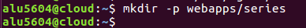
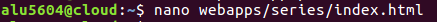
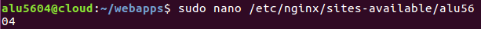
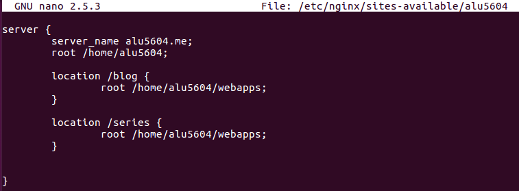
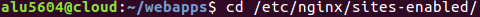
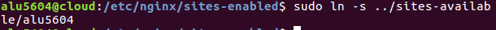
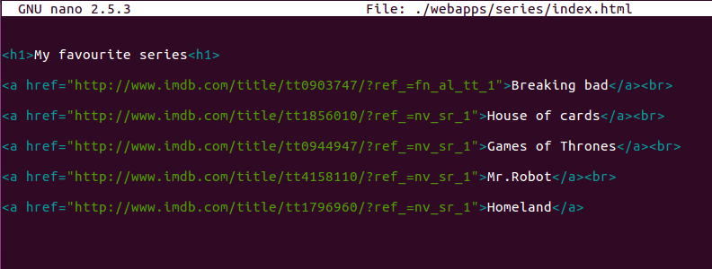
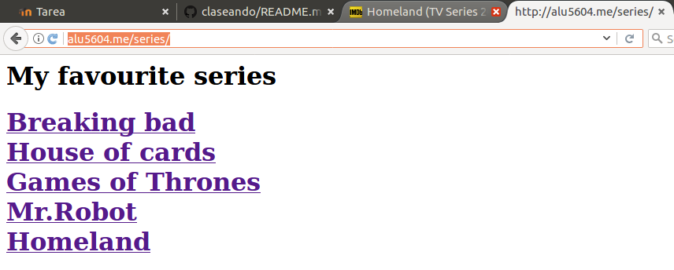

# Mis Series Favoritas

 <h2>1. Carpeta series<h2>

* Primero creamos la carpeta *webapps* y dentro de ella otra carpeta *series*.

* Después creamos el *index* que posteriormente vamos a editarlo a nuestro gusto.

<h2>2. Location dentro de Virtual Host<h2>
* Creamos el archivo de configuración nginx *alu5604* en la ruta. */etc/nginx/sites-available/alu5604*.

* Una vez dentro lo editamos de la siguiente forma.

>el location /blog no es necesario en esta actividad

* Nos movemos al directorio */etc/nginx/sites-enabled*

* Seguidamente creamos un enlace simbólico del archivo "sites-available/alu5604" a "sites-enabled/alu5604" para que pase a ser un sitio disponible.

* Para que cargue la configuración hay que reiniciar el servicio con el siguiente comando:

<h2>3. Modificar el index <h2>

* Modificamos el archivo index para que se muestre tal y como pide en la practica.

<h2>4.Resultado final<h2>

Link de la [página](alu5604.me/series)
