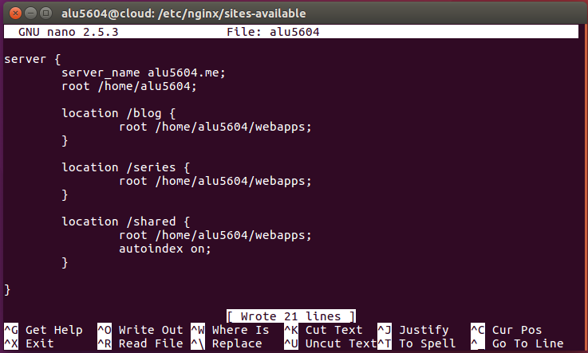
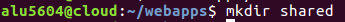
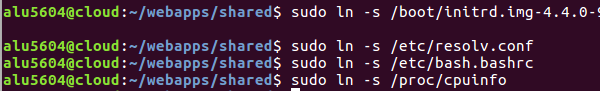
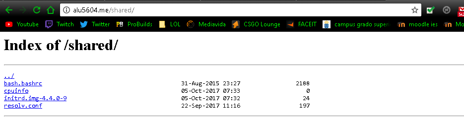

# UT1-A2: Listado de directorios

<h2>1. Modificar el fichero de configuración Nginx<h2>

Para acceder al listado de la forma *alu5604.me/shared* hay que modificar el fichero de configuración *alu5604* que ya hemos creado anteriormente.

Y añadimos el shared de la siguiente forma y con *autoindex on*

<h2>2. Crear la carpeta contenedora shared<h2>

Como anteriormente en el archivo de configuración pusimos el root en la línea */home/alu5604/webapps* debemos crear la carpeta *shared* en esta ubicación.

<h3>2.1 Crear enlaces simbólicos de los archivos<h3>

Tal y como dice en la práctica el listado shared debe contener diferentes archivos y para que estos archivos esten actualizados creamos enlaces simbólicos de ellos en vez de hacer copias y moverlos a la carpeta shared.

<h2>3. Resultado Final<h2>

El listado shared queda de esta forma

Link del [listado.](http://alu5604.me/shared/)
