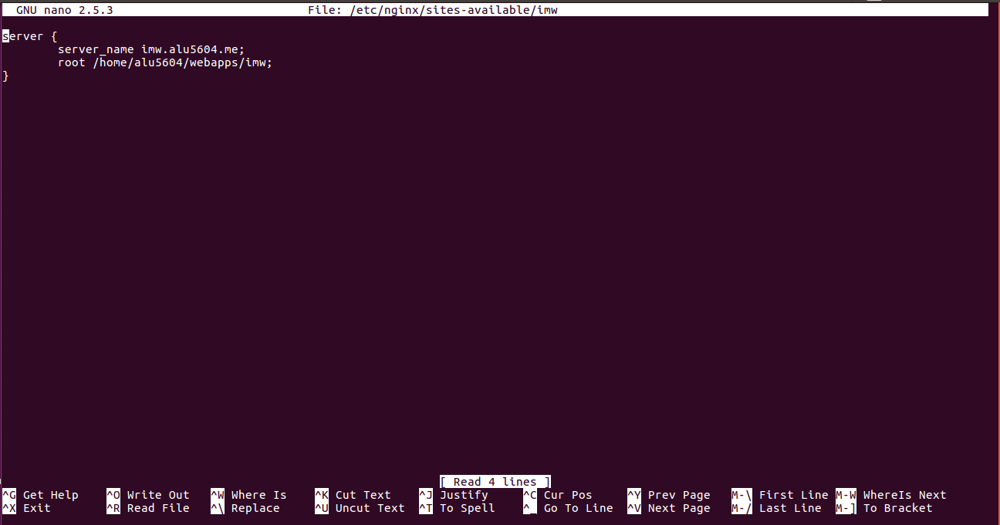
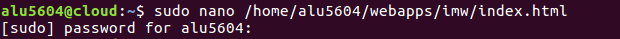
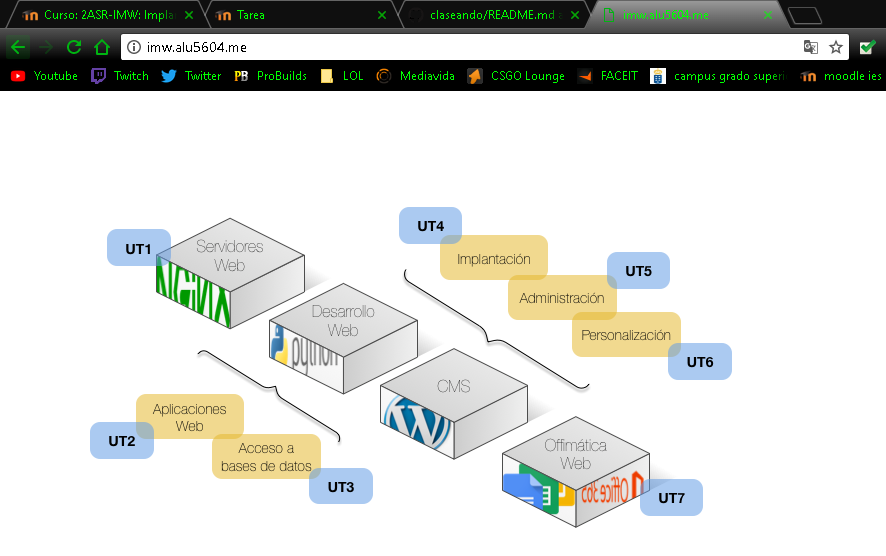

# Trabajo con Virtual Hosts

<h2>1. Sitio web 1</h2>

* http://imw.alu5604.me

Para crear la primera web, creamos un *archivo de configuración de Nginx* llamado *imw*.

Dentro del archivo creamos un server el nombre que pide, y como root la ruta de la carpeta que crearemos dentro de *webapps*.

Posteriormente creamos un enlace simbólico, como siempre,para que este disponible en *sites enables*.

A continuación, creamos las carpeta *imw* y dentro de ella la carpeta *img*.

Déspues para que en la web salga la imagen hay que descargarla.Para ello tenemos que salir del cloud.

Una vez en la máquina de desarrollo,descargamos la imagen y confirmamos que está en nuestro home.

Para poder llevar esa imagen al cloud tenemos que utilizar la herramienta scp.

Seguidamente, entramos al cloud ...

... una vez dentro movemos la imagen a la carpeta *img* que habíamos creado previamente.

Ya solo nos queda crear el index de *imw*.

Dentro de él solo ponemos la imagen en formato html, indicando la ruta de la misma.

Ya solo queda reiniciar el servicio.

Finalmente nos vamos a un navegador y ponemos el link.

* http://imw.alu5604.me/mec/

Para hacer la segunda parte de la primera web, modificamos el *archivo de configuración de Nginx* llamado imw(creado anteriormente).

Le añadimos un location llamado */mec* y le ponemos de root la ruta de una carpeta mec que vamos a crear dentro de webapps.

Creamos la carpeta mec dentro de webapps.

Dentro de ella creamos un index del */mec*.

El index lo modificamos poniendo un título y un enlace a un pdf que descargaremos más tarde (aprovechamos que ya sabemos el nombre del pdf y ponemos la ruta concreta).

Para descargar el pdf tenemos que salir del cloud.

Después de descargar el pdf en la máquina de desarrollo vamos a descargar y comprobamos que tenemos el archivo.

Al igual que antes tenemos que poner el pdf en la máquina cloud.

Después de volvernos a conectar al cloud.

Creamos una carpeta content para meter el pdf que hemos descargado.(además de que es la ruta que hemos puesto antes)

Por último reiniciamos el servicio.

Vamos a un navegador y ponemos la dirección web.

 

 Una vez dentro clickamos sobre el enlace y nos llevará al pdf,

  

<h2>2. Sitio web 2</h2>

* http://varlib.aluXXXX.me:9000

Para crear el sitio web 2 es muy fácil, creamos un *archivo de configuración de Nginx* llamado varlib.

Dentro del fichero ponemos el nombre del servidor, la ruta `root` ponemos `/var/lib`,ya que son los archivos a mostrar que pide la práctica, además ponemos se acceda a ella por el *puerto 9000* y ponemos el *autoindex*.

Después creamos el enlace simbólico en sites-enabled igual que en las anteriores ocasiones y reiniciamos el servicio.

Por último vamos a un navegador y ponemos la dirección de la web.

<h2>3. Sitio Web 3</h2>

Para crear la Web 3 vamos a aprovechar un *fichero de configuración de Nginx* llamado ssl que ya teníamos creado y con el link creado en *sites-enabled*.

Dentro de este, añadimos un *location* llamado *students* en el cual ponemos una autentificación(Usuario y Contraseña).Para ello es necesario especificar la ruta del archivo oculto .htpasswd que crearemos más adelante.

 Después creamos dentro de webapps la carpeta students para que la ruta que pusimos anteriormente cobre sentido.

 

 Para que se pueda hacer la autentificación necesitamos el fichero .htpasswd, este fichero tiene una estructura en la que cada línea identifica a un posible usuario en la forma:

 >`username:contraseña-encriptada:comentario`

 Por lo tanto, necesitamos encriptar la contraseña.Para ello utilizaremos el lenguaje *perl*.

  

A continuación, copiamos la contraseña encriptada y creamos el archivo .htpasswd dentro de *students* con usuario1 y dicha contraseña.

 

 Para asegurarnos de que se ha creado el archivo utilizamos el siguiente comando:

  

Después para que se vea el listado de nombre de alumnos vamos a la carpeta students que esta dentro de webapps y creamos un index de la siguiente forma:

 

  Por último, vamos a un navegador y ponemos la dirección web.Esta nos pide para entrar un usuario y contraseña (*usuario: usuario1 y contraseña: aula108*).

  Una vez ponemos el usuario y contraseña bien podemos ver la página con el listado de nombre de alumnos.

   

   <h2>4. Sitio Web 4</h2>

   Para crear la cuarta y última web,necesitamos crear un *archivo de configuración de Nginx* llamado target.

Dentro de este archivo configuramos las siguientes cosas:
* Que escuchara al puerto 80
* Pusimos la direccion de la página
*  la ruta de root

* y pusimos que los *acces_log* y *error_log* estuvieran en una ruta específica.

Posteriormente creamos la carpeta redirect para que la ruta que pusismos para los logs tenga sentido.

Depués creamos el enlace simbólico del archivo de configuración en *sites-enabled*.

Además para hacer la redirecciones creamos otro archivo de configuración para hacer las redirecciones.

Dentro de él ponemos la configuración necesaria para que cumpla con los requisitos de la práctica.

Al igual que en el otro archivo de configuración, creamos un enlace simbólico en sites-enabled.

Después de hacer esto reiniciamos el servicio.

Por último solo queda descargar la página web que ya esta creada.Para ello salimos de cloud.

Y una vez descargado el archivo zip lo compiamos al cloud mediante *scp*.

Volvemos a entrar en cloud.

Miramos que este el archivo en nuestro home, e instalo el unzip ya que no lo tenia intalado.

Una vez instalado, descomprimimos el archivo.

Despues movemos el archivo descomprimido a webapps y le ponemos el nombre de target para que coincida con la ruta que pusimos en el archivo de configuración.

Finalmente ya podemos ir al navegador y comprobar la página web y si los redirects están bien.

>Links de redirect:

>* http://redirect.alu5604.me/test/

>* http://www.redirect.alu5604.me/probando/

>* http://www.redirect.alu5604.me/hola/
