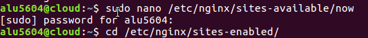

# Sirviendo aplicaciones Php y Python

## Sitio web1

* http://php.alu5604.me

Para hacer la primera web, creamos un archivo de configuración de ngninx llamado *php*: `sudo nano php`

* Ponemos de root la ruta siguiente: `/home/alu5604/webapps/demo_php`, la cual crearemos posteriormente.

* Además añadimos un location de *php*.

Posteriormente creamos el enlace simbólico a sites enables con `ln -s`.

Después para mostrar la aplicación *demo_php* descargamos el archivo en la máquina de desarrollo.

Ahora utilizamos el comando `scp` para copiarlo a la máquina de producción.

Para comprobar que se copió vamos al *cloud* y hacemos un `ls`.

Seguidamente descomprimimos el archivo.

Ahora lo movemos a la ruta `/home/alu5604/webapps/` para que coincida con la ruta de root.

Finalmente ya solo queda reiniciar el *servicio ngninx*

