# Sirviendo aplicaciones Php y Python

## Sitio web1

> * http://php.alu5604.me

Para hacer la primera web, creamos un archivo de configuración de ngninx llamado *php*: `sudo nano php`

* Ponemos de root la ruta siguiente: `/home/alu5604/webapps/demo_php`, la cual crearemos posteriormente.

* Además añadimos un location de *php*.

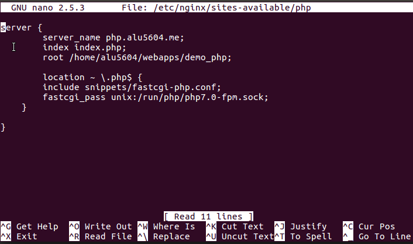

Posteriormente creamos el enlace simbólico a sites enables con `ln -s`.

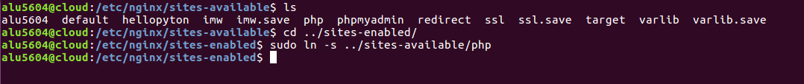

Después para mostrar la aplicación *demo_php* descargamos el archivo en la máquina de desarrollo.

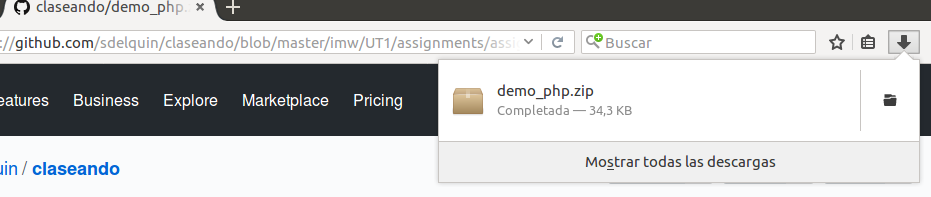

Ahora utilizamos el comando `scp` para copiarlo a la máquina de producción.

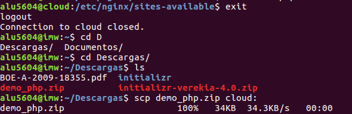

Para comprobar que se copió vamos al *cloud* y hacemos un `ls`.

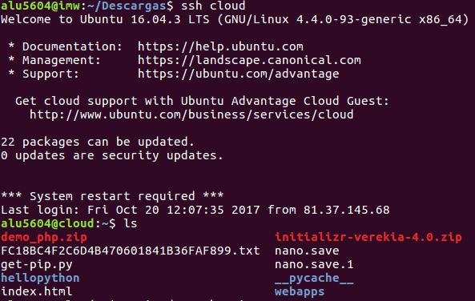

Seguidamente descomprimimos el archivo.

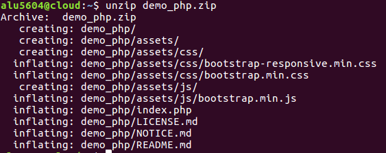

Ahora lo movemos a la ruta `/home/alu5604/webapps/` para que coincida con la ruta de root.

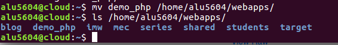

Finalmente ya solo queda reiniciar el *servicio ngninx*:

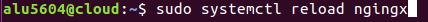

Ahora vamos a al navegador y probamos la dirección.

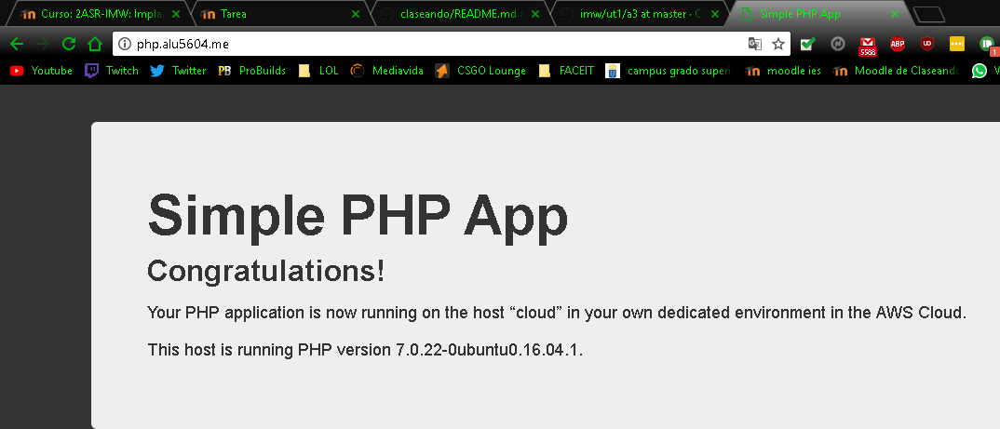

## Sitio web2

> * http://now.alu5604.me

Para hacer la segunda web, creamos un archivo de configuración de ngninx llamado *now*: `sudo nano now`

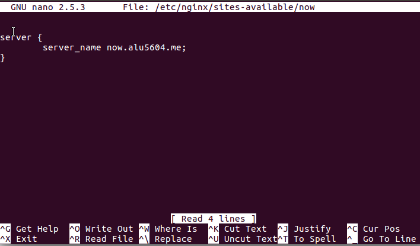

Posteriormente hacemos el enlace simbólico en *sites-enable* al igual que en todas la prácticas anteriores.

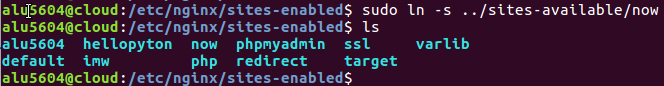

Reiniciamos el servicio *nginx*.

A continuación creamos un entorno virtual.

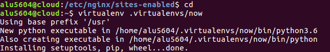

* Instalamos los siguientes paquetes:
  * *uwsgi*
  * *flask*
  * *pytz*

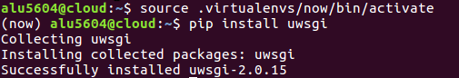

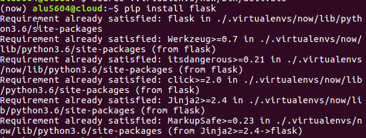

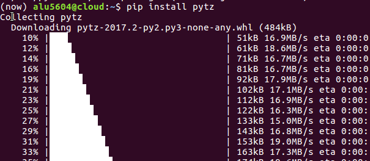

A continuación creamos fichero en *python*, dentro de la carpeta now que creamos,este va a contener el código de la aplicación web.

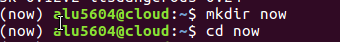

`nano main.py`

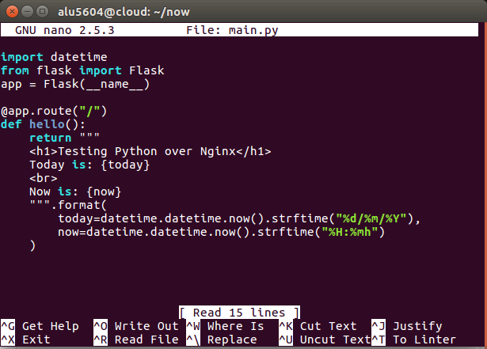

En este punto podemos lanzar el proceso para escuchar peticiones.
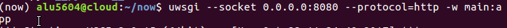

Por esto vamos a un navegador y probamos la dirección. (Utilizando el puerto 8080 que definimos en el proceso anterior).

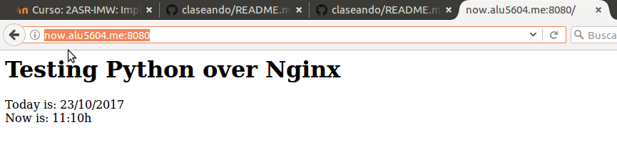

Después de haber salido del entorno virtual (mediante `deactivate`) creamos un fichero de configuración para *uWSGI* dentro de la carpeta `now`.

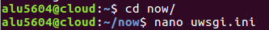

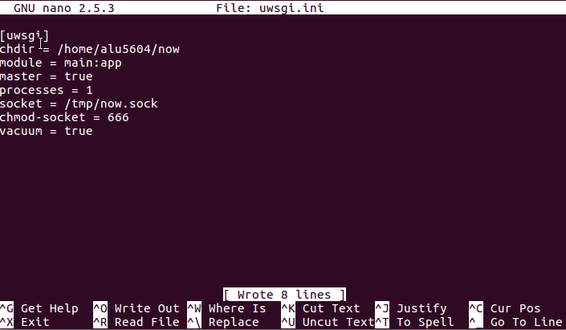

Ahora tenemos que crear un  script llamado `run.sh` que será el encargado de activar el entorno virtual de nuestra aplicación y de lanzar el proceso *uwsgi* para que escuche peticiones en el socket especificado.

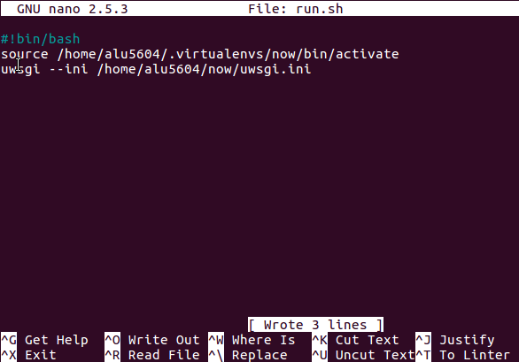

Para que se pueda ejecutar le modificamos los permisos.

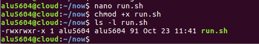

En este punto lanzamos el script sin necesidad de activar el entorno virtual.

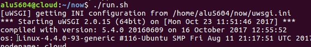

Vamos a un navegador y comprobamos que esta funcionando correctamete.

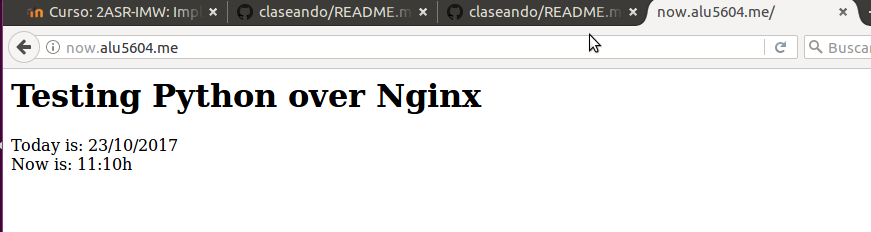

Ahora creamos un supervisor.
Vamos a la siguiente ruta(`/etc/supervisor/conf.d/`) y hacemos un archivo de configuración de supervisor `now.conf`.

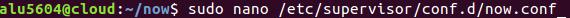

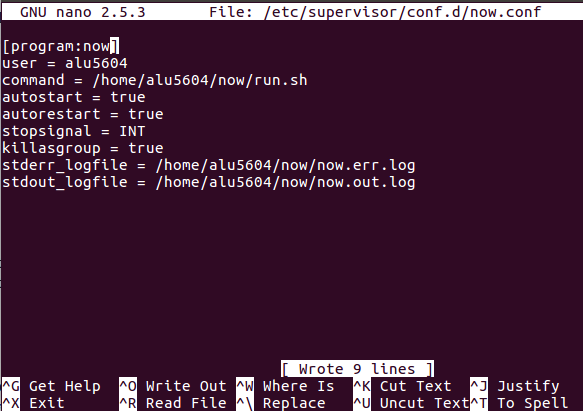

Iniciamos el supervisor:

Realizamos los siguientes comandos de comprobación.

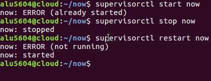

Comprobamos el resultado final mirando la página en un navegador solo con el supervisor activo,

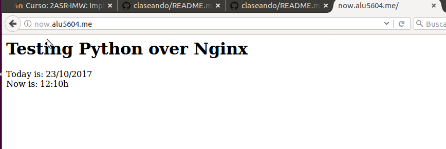
