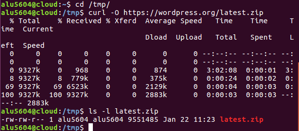
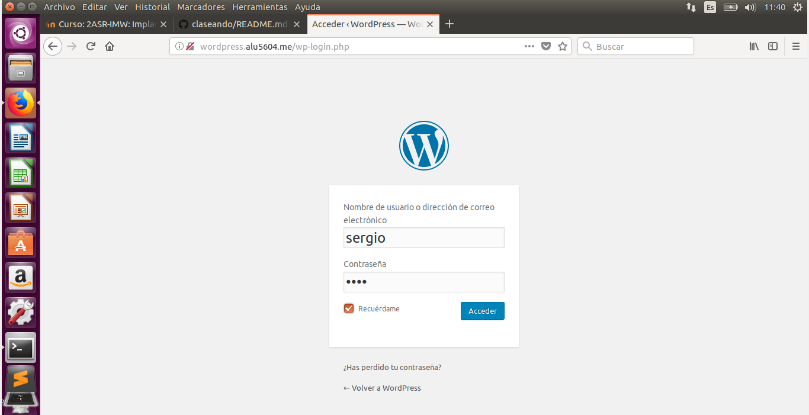

# Implantación de Wordpress

* Para instalar *Wordpress* necesitamos crearle un usuario y contraseña para que acceda a la base de datos.Para ello utilizaremos *Mysql*.

* Creamos la base de datos, el usuario y le asignamos privilegios:

* A continuación, descargamos el código fuente de *Wordpress* directamente de su página web.

* Descomprimimos el código y lo copiamos en `/usr/share`:

* Ahora cambiamos el propietario de la carpeta `/usr/share/wordpress/`.

* También debemos especificar el nombre de la base de datos, el usuario y la contraseña, para que *Wordpress* pueda usarlos (utilizamos una plantilla por defecto y cambiamos los campos necesarios):

* Para que nuestro sitio *Wordpress* sea accesible desde un navegador web, debemos incluir las directivas necesarias en la configuración del servidor web *Nginx*.Para ello tendremos que crear un nuevo virtual host de la siguiente manera:

> corrijo el error que cometí  en el nombre del archivo.

* Enlazamos la configuración para que el virtual host esté disponible.

* Recargamos el servidor web Nginx.

* Ahora podemos acceder a la dirección de nuestro servidor para configurar nuestro Wordpress vía web. (`wordpress.alu5604.me`)

* Elegimos el idioma Español y le damos a `Continuar`:

* Rellenamos los campos que nos piden y pulsamos `Instalar Wordpress`:

* Pulsamos en el botón `Acceder` e ingresamos el usuario y contraseña que pusimos anteriormente:

* Una vez dentro de la interfaz administrativa, vamos a descargarnos un tema e instalarlo.Para ello pinchamos sobre `cambia tu tema por completo`.

* Seguidamente seleccionamos algún tema de wordpress.Y pulsamos en `Instalar y previsualizar`.

* En mi caso es necesario instalr un plugin.

* Una vez instalado el plugin, te lleva a una pestaña para activarlo.

* Finalmente solo nos queda activar el tema que nos hemos descargado, para ello nos vamos a la pestaña de la izquierda llamada `Apariencia` y seleccionamos `Temas`. Una vez ahí solo tenemos que poner el cursor del ratón sobre el tema que queremos y pulsamos en `Activar`.

* Para ver como queda el nuevo tema debemos hacer lo siguiente:

* Ahora vamos a configurar los enlaces permanentes.Nos situamos en el `Escritorio` de nuesto *Wordpress*.

* Y nos vamos a la pestaña de la izquierda llamada `Ajustes` y pinchamos sobre `Enlaces permanentes`.

* Una vez ahi seleccionamos la opción de día y nombre. Guardamos los cambios.

* Ahora debemos indicar a Nginx que procese estas URLs:

* Recargamos *Nginx*:

* Ahora vamos a cambiar el límite de tamaño en la subida de archivos.Para incrementarlo, debemos hacer lo  siguiente, como `root` en la *máquina de producción*:

* Ahora reinciamos el servicio *php-fpm*:

* Además de esto, debemos añadir una línea en el fichero de configuración de *Nginx*:

* Reiniciamos el servicio *Nginx*:

* Ahora vamos a añadir un post con  las estadísticas de uso de *Wordpress*. Para ello pulsamos en lo siguiente:

* A continuación, le ponemos un título y copiamos las estadísticas de *Wordpress*

* Ya solo nos queda publicarlo.

* Una vez publicado, nos saldra una notificación, la cual aprovecharemos para ver el resultado final del post.

